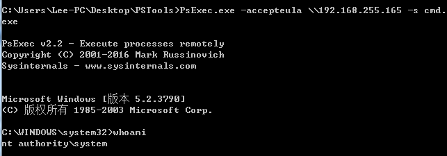
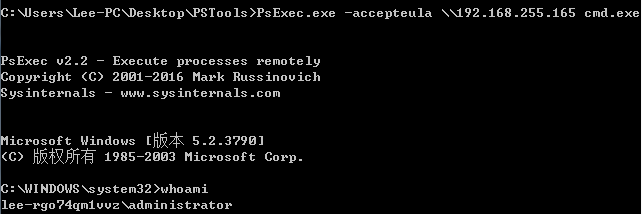
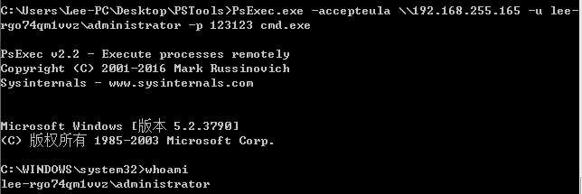

## IPC$

IPC$(Internet Process Connection)是共享"命名管道"的资源，它是为了让进程间通信而开放的命名管道，通过提供可信任的用户名和密码，连接双方可以建立安全的通道并以此通道进行加密资料的交换，从而实现对远端电脑的访问，经常使用 ```\\IP\C$``` 来取自己电脑上的东西。

IPC$是NT/2000的一项新功能，它有一个特点，即在同一时间内，两个IP之间只允许建立一个连接。NT/2000在提供了ipc$功能的同時，在初次安裝系统时开放了预设共享，即所有的逻辑共享(c$,d$,e$……)和系统目录winnt或windows(admin$)共享。目的是为了方便管理员管理，可导致系统安全性降低。


## 空会话

空会话是在没有信任的情况下与服务器建立的会话（即未提供用户名与密码）。

根据WIN2000（以win2000为例）的访问控制模型，空会话的建立同样需要提供一个令牌，可是空会话在建立过程中并没有经过用户信息的认证，所以这个令牌中不包含用户信息，因此，这个会话不能让系统间发送加密信息，但这并不表示空会话的令牌中不包含安全标识符SID（它标识了用户和所属组），对于一个空会话，LSA提供的令牌的SID是S-1-5-7，这就是空会话的SID，用户名是：ANONYMOUS LOGON（这个用户名是可以在用户列表中看到的，但是是不能在SAM数据库中找到，属于系统内置的帐号），这个访问令牌包含下面伪装的组：

Everyone

Network

在安全策略的限制下，这个空会话将被授权访问到上面两个组有权访问到的一切信息。


对于 **NT**，在默认安全设置下，借助空连接可以列举目标主机上的用户和共享，访问everyone权限的共享，访问小部分注册表等，并没有什么太大的利用价值；对2000作用更小，因为在Windows 2000 和以后版本中默认只有管理员和备份操作员有权从网络访问到注册表，而且实现起来也不方便，需借助工具。

查看开启的共享：

	net share


win2k及以上测试均未成功，安全性提高：


这篇文章[IPC $（空连接）及其造成的危险](https://blog.csdn.net/qq_45521281/article/details/105820827)写得很详细，但我在xp/win7测试均为成功，与文中描述不符。

## 利用 IPC$ 远程命令执行

### net use 用法

**net use  需要靶机关闭防火墙才可连接**

需要远程计算机开启admin$共享 (默认开启)

建立一个连接：

	net use \\192.168.255.156\ipc$ "123123" /user:win-toe27pj73hs\lee-pc

或：
	
	net use \\192.168.255.156\ipc$ "123123" /user:lee-pc

推荐使用上面带hostname的命令，否则可能会报错：


通过查看共享检查PTH是否成功：

	at \\ip


删除共享 (注意要用斜杠 /del)

	net use  \\192.168.255.156\ipc$ /del  


使用```net use```检查网络连接：


### psexec 远控

微软官网提供的sysinternals工具集PSTools : [PSTools](https://docs.microsoft.com/zh-cn/sysinternals/downloads/psexec)

[使用PsExec获得windows远程控制权限](https://zhuanlan.zhihu.com/p/228742108?utm_source=wechat_session)

第一步：建立IPC$管道

使用上面的```net use``` 方式


第二步：通过PsExec.exe获得远程系统的控制权

	PsExec.exe -accepteula \\192.168.255.165 -s cmd.exe

	-accepteula 确保不会弹出确认对话框
	-s 获取系统权限（System）



	PsExec.exe -accepteula \\192.168.255.165 cmd.exe



如果没有提前建立好IPC$，PsExec也可以通过指定账号和密码的方式，进行远程连接。

	PsExec.exe -accepteula \\192.168.255.165 -u win-toe27pj73hs\lee-pc -p 123123 cmd.exe
	
	PsExec.exe -accepteula \\192.168.255.165 -u lee-rgo74qm1vvz\administrator -p 123123 cmd.exe 

**在使用PsExec时临时创建net use 连接，结束cmd时会自动关闭**



下面的错误可能由于没有输入 domain:


## 参考资料

[win10系统电脑怎么禁止IPC$空连接的方法](http://www.ylmfwin100.com/ylmf/12323.html)

[关闭默认共享，禁止ipc$空连接](https://www.bbsmax.com/A/1O5EbnrWd7/)

[**net use错误原因解决**](https://www.cnblogs.com/zhuimengle/p/6030414.html)